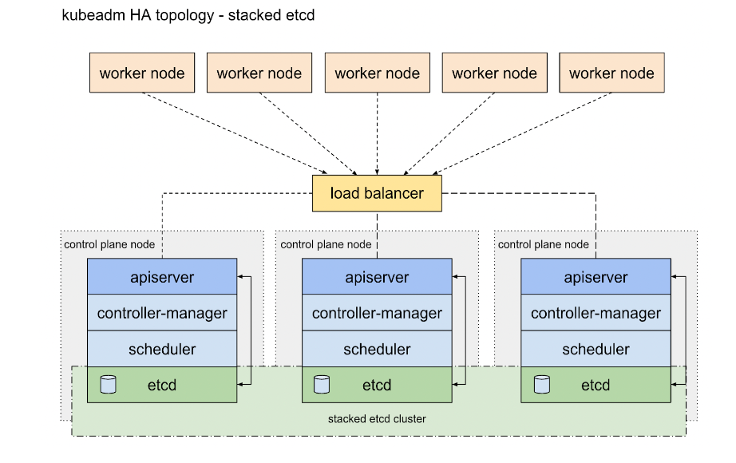

# kubespray-kubernetes-multimaster
Kubernetes with ansible using Kubespray

## Topologi

- List Server 

| HOSTNAME    | IP            | KETERANGAN                                 |   OS             |
| :--------   | :-------      | :----------------------------------------- | :--------------  |
| `lb-master` | `10.10.90.51` | Load balance for kube api-server port 6443 | Ubuntu 22.04 LTS |
| `master-01` | `10.10.90.52` | Controle plane                             | Ubuntu 22.04 LTS |
| `master-02` | `10.10.90.53` | Controle plane                             | Ubuntu 22.04 LTS |
| `master-03` | `10.10.90.54` | Controle plane                             | Ubuntu 22.04 LTS |
| `worker-01` | `10.10.90.55` | Worker                                     | Ubuntu 22.04 LTS |
| `worker-02` | `10.10.90.56` | Worker                                     | Ubuntu 22.04 LTS |
| `worker-03` | `10.10.90.57` | Worker                                     | Ubuntu 22.04 LTS |
